Q1

    ## ── Attaching packages ─────────────────────────────────────── tidyverse 1.3.1 ──

    ## ✓ ggplot2 3.3.5     ✓ purrr   0.3.4
    ## ✓ tibble  3.1.6     ✓ dplyr   1.0.7
    ## ✓ tidyr   1.1.4     ✓ stringr 1.4.0
    ## ✓ readr   2.1.1     ✓ forcats 0.5.1

    ## ── Conflicts ────────────────────────────────────────── tidyverse_conflicts() ──
    ## x dplyr::filter() masks stats::filter()
    ## x dplyr::lag()    masks stats::lag()

    ## 
    ## Attaching package: 'scales'

    ## The following object is masked from 'package:purrr':
    ## 
    ##     discard

    ## The following object is masked from 'package:readr':
    ## 
    ##     col_factor

First lets play with our data and breakdown the delays

    ## # A tibble: 5 × 4
    ##   ArrDelay avg_ArrDelay min_ArrDelay max_ArrDelay
    ##      <dbl>        <dbl>        <dbl>        <dbl>
    ## 1     -129         -129         -129         -129
    ## 2     -109         -109         -109         -109
    ## 3      -81          -81          -81          -81
    ## 4      -79          -79          -79          -79
    ## 5      -76          -76          -76          -76

Now we want to focus on those 7 variables

    ##      Month         DayofMonth    UniqueCarrier         Origin         
    ##  Min.   : 1.00   Min.   : 1.00   Length:99260       Length:99260      
    ##  1st Qu.: 3.00   1st Qu.: 8.00   Class :character   Class :character  
    ##  Median : 6.00   Median :16.00   Mode  :character   Mode  :character  
    ##  Mean   : 6.29   Mean   :15.73                                        
    ##  3rd Qu.: 9.00   3rd Qu.:23.00                                        
    ##  Max.   :12.00   Max.   :31.00                                        
    ##                                                                       
    ##      Dest              ArrDelay           DepDelay      
    ##  Length:99260       Min.   :-129.000   Min.   :-42.000  
    ##  Class :character   1st Qu.:  -9.000   1st Qu.: -4.000  
    ##  Mode  :character   Median :  -2.000   Median :  0.000  
    ##                     Mean   :   7.065   Mean   :  9.171  
    ##                     3rd Qu.:  10.000   3rd Qu.:  8.000  
    ##                     Max.   : 948.000   Max.   :875.000  
    ##                     NA's   :1601       NA's   :1413

So which airline with the most departure delays?

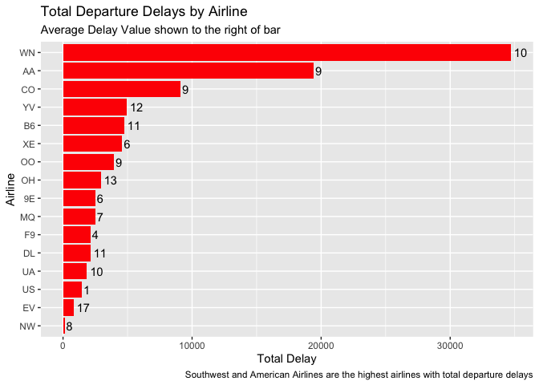

No wonder American Airlines is the 2nd on the list.

Now let’s jump to the delay of Arrival flights.

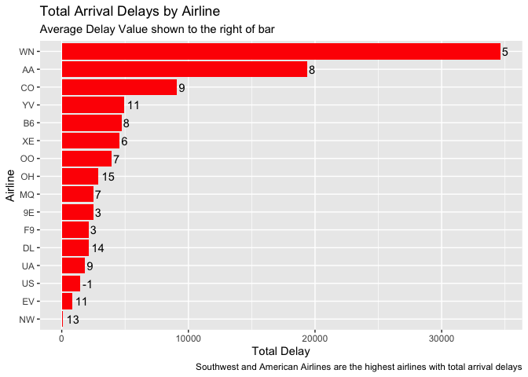

Departure delays per airline by months:

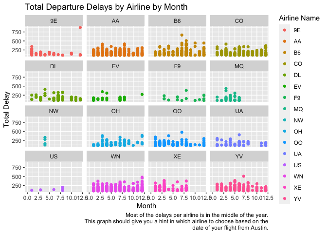

Arrival delays per airline by months:

    ## Warning: Removed 20 rows containing missing values (geom_point).

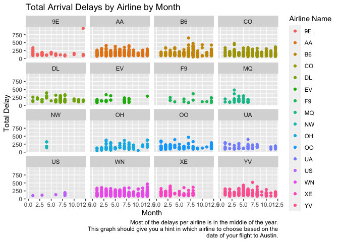

Now let’s analyze the top 2 airlines with highest total delays:

Southwest Departure:

    ## Warning: Removed 9 rows containing missing values (geom_text).

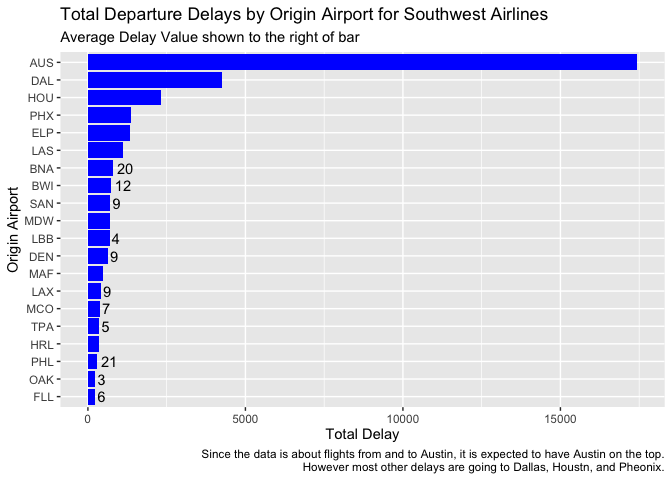

Southwest Airlines Arrival:

    ## Warning: Removed 17 rows containing missing values (geom_text).

Now Lets move to American Airlines Departure:

    ## Warning: Removed 8 rows containing missing values (geom_text).

American Airlines Arrival:

    A_AA = D %>% 
      filter(UniqueCarrier=="AA" & !is.na(Origin)& !is.na(Origin)) %>%   
      group_by(Origin) %>%
      summarise(n = length(Origin), total = sum(ArrDelay), avrdelay4 = mean(ArrDelay)) %>%
      arrange(desc(n)) %>%
      data.frame() %>%
      top_n(20, wt=n)

    ggplot(A_AA, aes(x=reorder(Origin, n), y=n, label=round(avrdelay4, digits = 0))) + 
      geom_bar(stat="identity", fill="blue") +
      coord_flip() +
      geom_text(position=position_dodge(width=0.5), hjust=-0.25) + 
      labs(title = "Total Departure Delays by Origin Airport for American Airlines",
           x = "Origin Airport",
           y = "Total Delay",
           subtitle = "Average Delay Value shown to the right of bar",
           caption = "Since the data is about flights from and to Austin, it is expected to have Austin on the top.
           However most other delays are going to Dallas and Chicago.")

    ## Warning: Removed 8 rows containing missing values (geom_text).

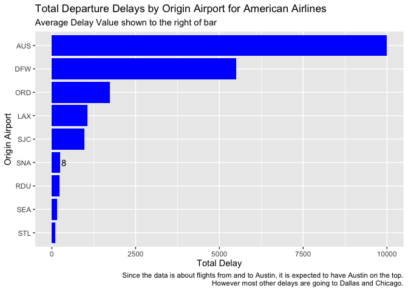

I hope now you have a better idea in how to plan for your spring break.
Make sure you don’t miss any minute.

Q2

    ## 
    ## Attaching package: 'data.table'

    ## The following objects are masked from 'package:dplyr':
    ## 
    ##     between, first, last

    ## The following object is masked from 'package:purrr':
    ## 
    ##     transpose

PartA

As we can see, Radioactive by Imagine dragons is the most popular song
according to the billboard.

PartB

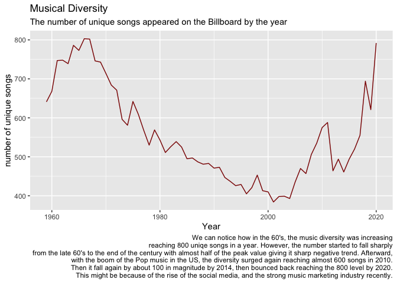

PartC

    ## `summarise()` has grouped output by 'performer'. You can override using the `.groups` argument.

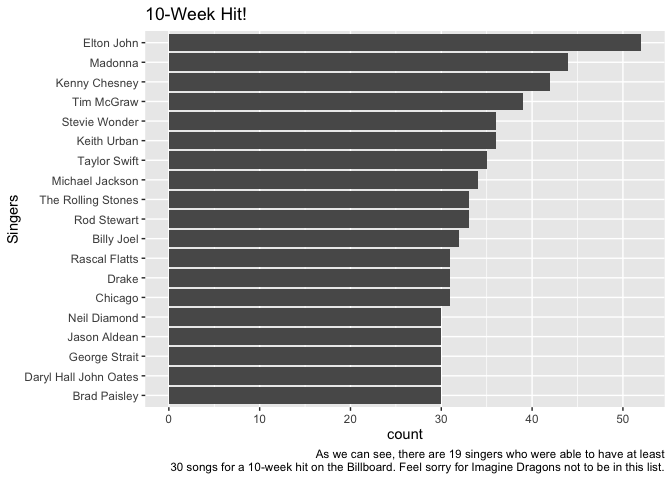

Q3

    ## 
    ## Attaching package: 'matrixStats'

    ## The following object is masked from 'package:dplyr':
    ## 
    ##     count

1st part

    ## # A tibble: 6 × 2
    ##   height `quantile(olympics_top20$height, 0.95)`
    ##    <int>                                   <dbl>
    ## 1    150                                     197
    ## 2    152                                     197
    ## 3    153                                     197
    ## 4    154                                     197
    ## 5    155                                     197
    ## 6    156                                     197

    ## [1] 197

So The 95th percentile of height for females in the Atheleics games is
197

2nd part

    ## [1] 3.250641 4.901056 4.717335 4.897333

So, Canoeing Women’s Kayak Singles 500 metres event has the highest
standard deviation in height

part 3

    ## Joining, by = "year"

    ## Warning: Removed 6 row(s) containing missing values (geom_path).

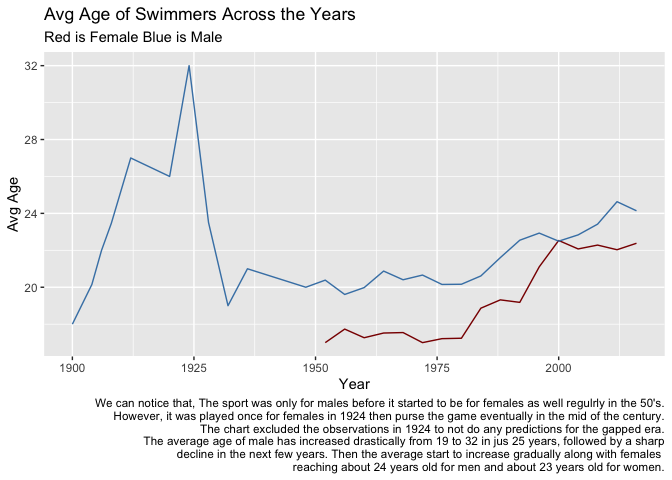

As it shown in the graph, we can notice that, The sport was only for
males before it started to be for females as well regularly in the
50’s.However, it was played once for females in 1924 then purse the game
eventually in the mid of the century.

The chart excluded the observations in 1924 to not do any predictions
for the gapped era. The average age of male has increased drastically
from 19 to 32 in jus 25 years, followed by a sharp decline in the next
few years. Then the average start to increase gradually along with
females reaching about 24 years old for men and about 23 years old for
women.

Q4

    ## Loading required package: lattice

    ## 
    ## Attaching package: 'caret'

    ## The following object is masked from 'package:purrr':
    ## 
    ##     lift

    ## 
    ## Attaching package: 'foreach'

    ## The following objects are masked from 'package:purrr':
    ## 
    ##     accumulate, when

Filter the data by trim

    ##      price            trim              mileage      
    ##  Min.   :  6600   Length:416         Min.   :     6  
    ##  1st Qu.: 19401   Class :character   1st Qu.: 19264  
    ##  Median : 52900   Mode  :character   Median : 29998  
    ##  Mean   : 46854                      Mean   : 42926  
    ##  3rd Qu.: 61991                      3rd Qu.: 63479  
    ##  Max.   :106010                      Max.   :173000

    ##      price            trim              mileage      
    ##  Min.   : 23990   Length:1413        Min.   :     1  
    ##  1st Qu.: 62995   Class :character   1st Qu.:    12  
    ##  Median :150735   Mode  :character   Median :    60  
    ##  Mean   :119549                      Mean   : 19354  
    ##  3rd Qu.:163055                      3rd Qu.: 36083  
    ##  Max.   :251025                      Max.   :147851

plot the data for both trims

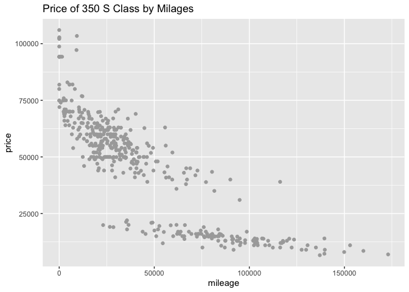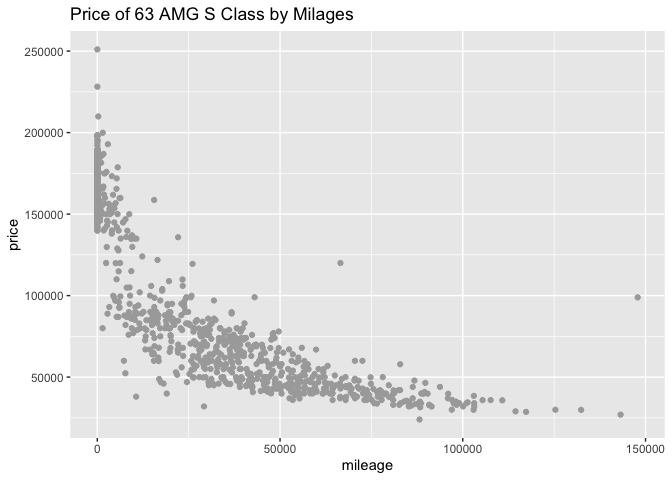

Make a train-test split for both trims

Fit a linear model for both trims

    ##  (Intercept)      mileage 
    ## 71217.197621    -0.570995

    ##   (Intercept)       mileage 
    ## 152455.620890     -1.707687

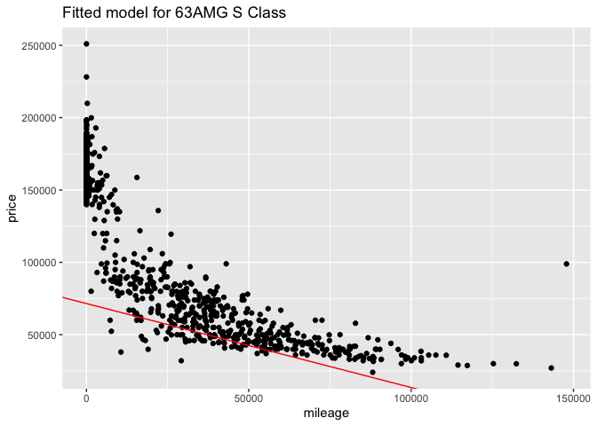

Now lets try KNN model with K = 2, 5, 10, 20, 30, 35, 40, 45, 50, 55,
60, 80, 100, 150, 200

First for 350 S Class and we will view the RMSE

    knn2_350 = knnreg(price ~ mileage, data=class350_train, k=2)
    rmse(knn2_350, class350_test)

    ## [1] 9372.635

    knn5_350 = knnreg(price ~ mileage, data=class350_train, k=5)
    rmse(knn5_350, class350_test)

    ## [1] 8379.086

    knn10_350 = knnreg(price ~ mileage, data=class350_train, k=10)
    rmse(knn10_350, class350_test)

    ## [1] 8599.676

    knn20_350 = knnreg(price ~ mileage, data=class350_train, k=20)
    rmse(knn20_350, class350_test)

    ## [1] 8602.516

    knn30_350 = knnreg(price ~ mileage, data=class350_train, k=30)
    rmse(knn30_350, class350_test)

    ## [1] 8775.661

    knn35_350 = knnreg(price ~ mileage, data=class350_train, k=35)
    rmse(knn35_350, class350_test)

    ## [1] 8605.477

    knn40_350 = knnreg(price ~ mileage, data=class350_train, k=40)
    rmse(knn40_350, class350_test)

    ## [1] 8620.351

    knn45_350 = knnreg(price ~ mileage, data=class350_train, k=45)
    rmse(knn45_350, class350_test)

    ## [1] 8547.062

    knn50_350 = knnreg(price ~ mileage, data=class350_train, k=50)
    rmse(knn50_350, class350_test)

    ## [1] 8578.653

    knn55_350 = knnreg(price ~ mileage, data=class350_train, k=55)
    rmse(knn55_350, class350_test)

    ## [1] 8708.184

    knn60_350 = knnreg(price ~ mileage, data=class350_train, k=60)
    rmse(knn60_350, class350_test)

    ## [1] 8714.721

    knn80_350 = knnreg(price ~ mileage, data=class350_train, k=80)
    rmse(knn80_350, class350_test)

    ## [1] 9151.087

    knn100_350 = knnreg(price ~ mileage, data=class350_train, k=100)
    rmse(knn100_350, class350_test)

    ## [1] 9949.929

    knn150_350 = knnreg(price ~ mileage, data=class350_train, k=150)
    rmse(knn150_350, class350_test)

    ## [1] 12615.56

    knn200_350 = knnreg(price ~ mileage, data=class350_train, k=200)
    rmse(knn200_350, class350_test)

    ## [1] 15168.73

Now the same for 63AMG S Class

    ## [1] 17252.41

    ## [1] 15578.65

    ## [1] 14616.04

    ## [1] 14353.1

    ## [1] 14182.94

    ## [1] 14252.61

    ## [1] 14267.92

    ## [1] 14230.98

    ## [1] 14220.44

    ## [1] 14128.48

    ## [1] 14173.74

    ## [1] 14210.38

    ## [1] 14385.18

    ## [1] 15145.4

    ## [1] 16208.11

Lets plot the fit

350 S Class

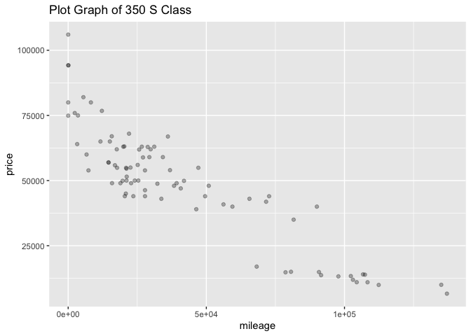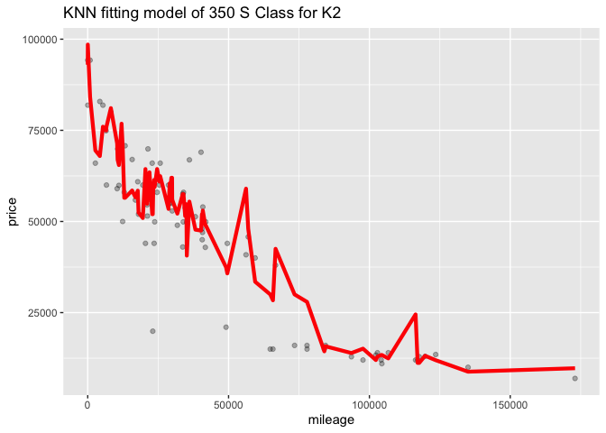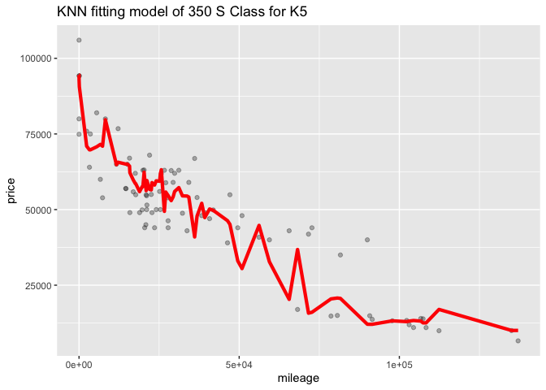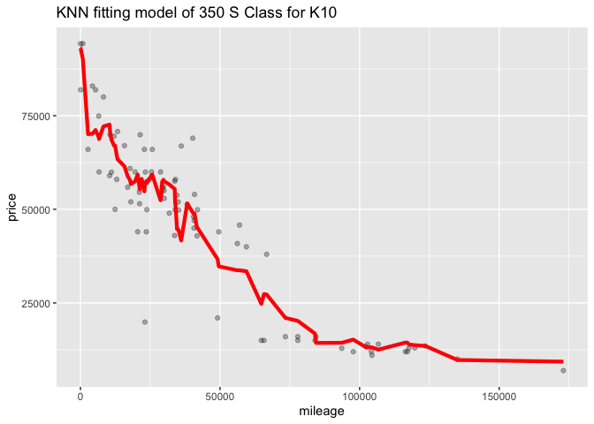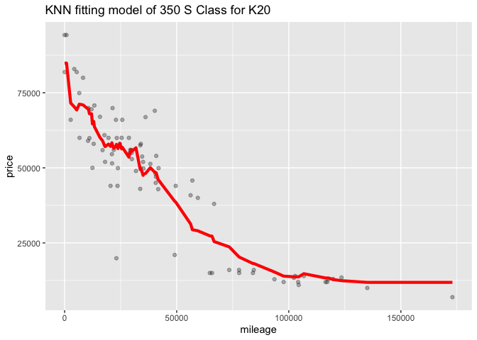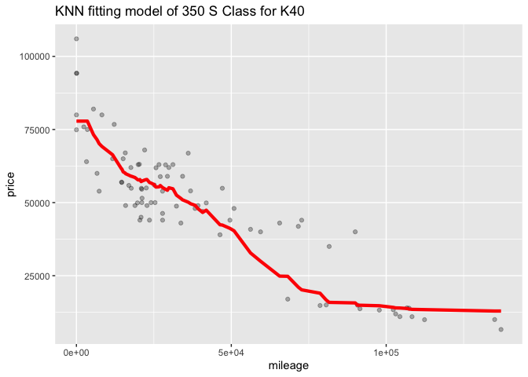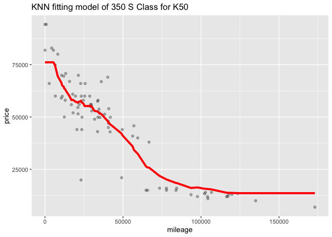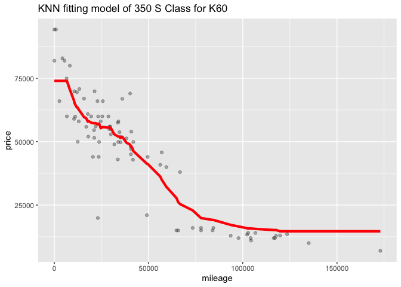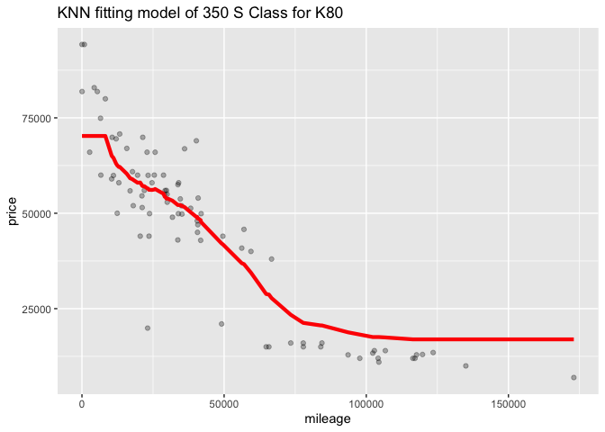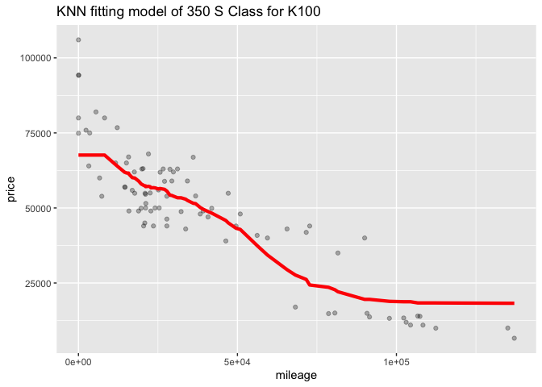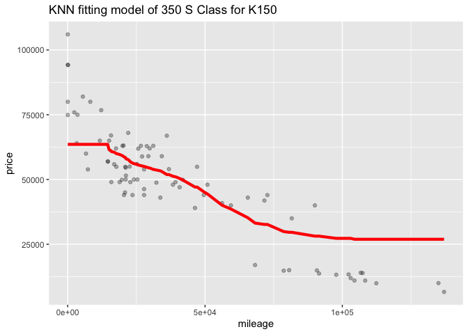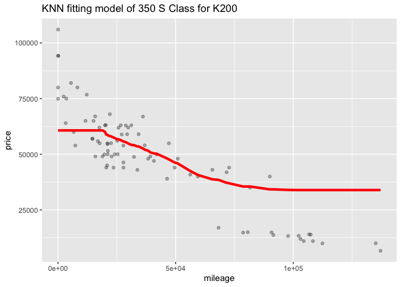

Now lets have a look at the fitting of 63AMG S Class model

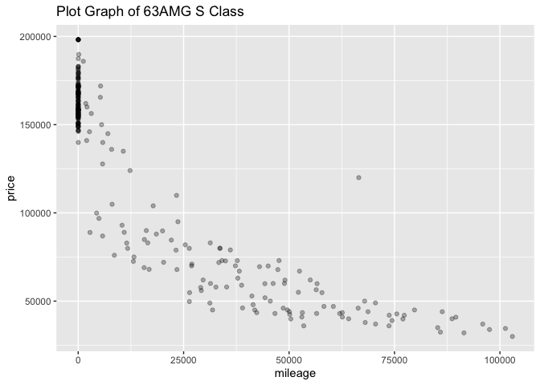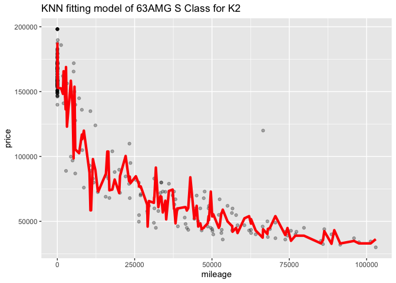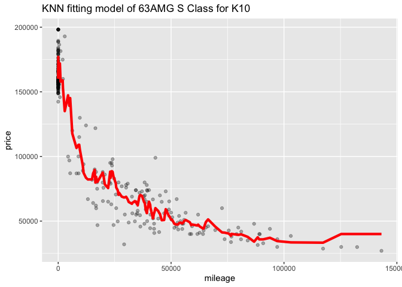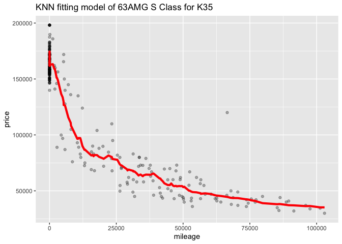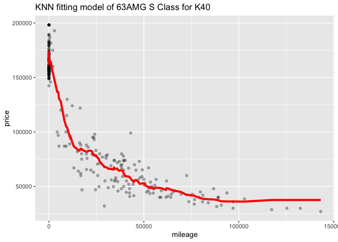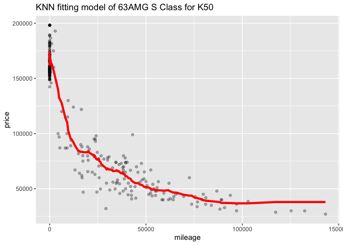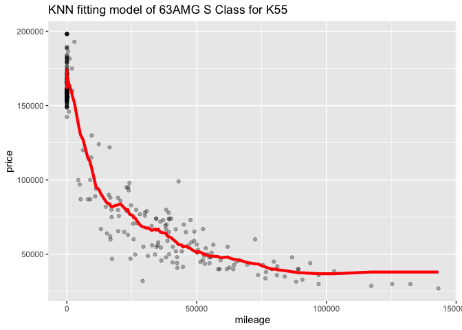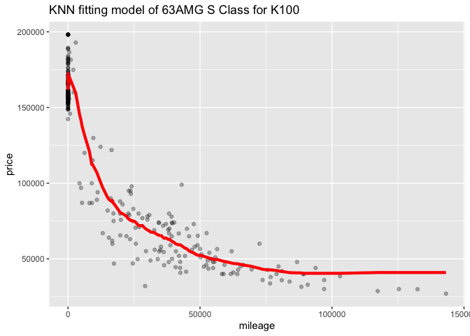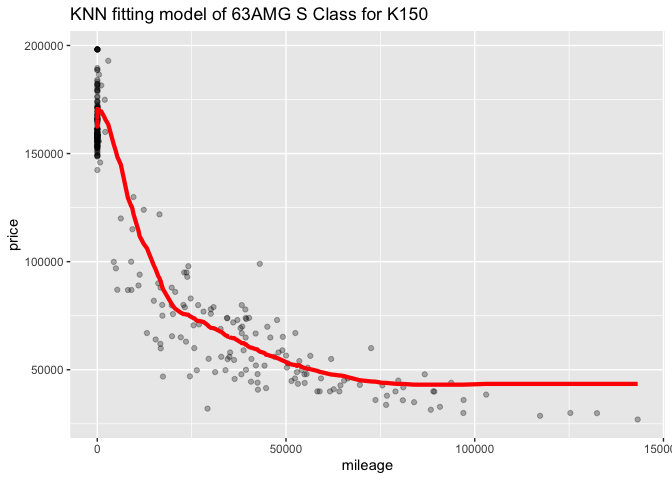

## Class63AMG

Now lets do the cross validation for both trims

    ## [1] 11274.98

    ## [1] 712.5203

    ## Warning: executing %dopar% sequentially: no parallel backend registered

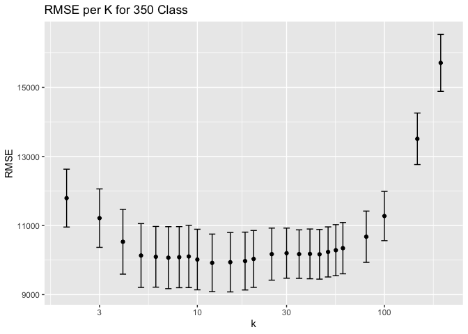

    ## [1] 14624.39

    ## [1] 572.9987

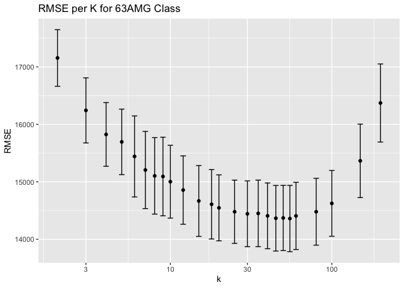

Based on the RMSE numbers, I would use K35 for 350 S Class and K80 or
K100 for 63AMG Class.

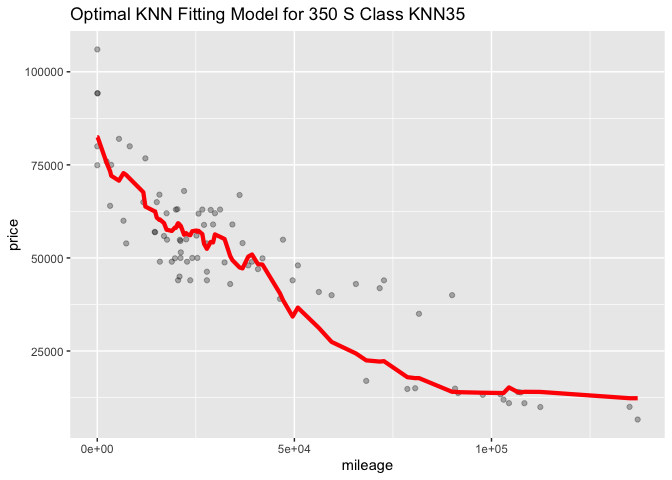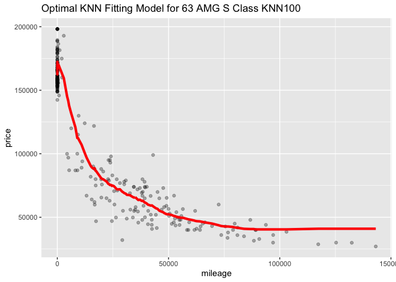

So 63 AMG class has the higher optimal value of K since it has more
clustered obs in different areas of the graph. Also the plot points are
more scattered than for 350 Class. So, the predicted line might have
more bias but less variance.
