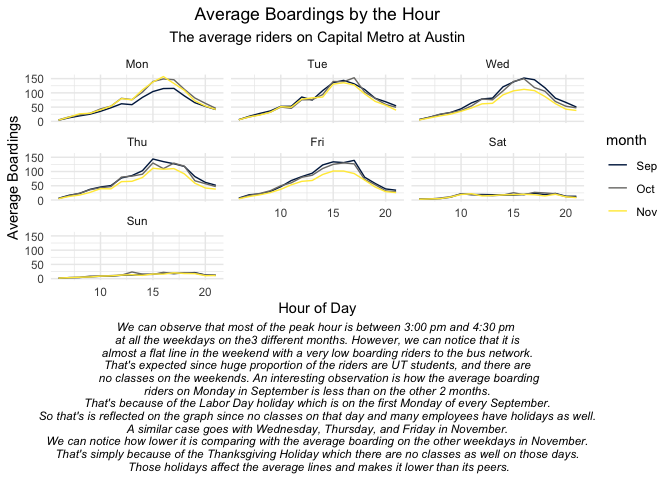
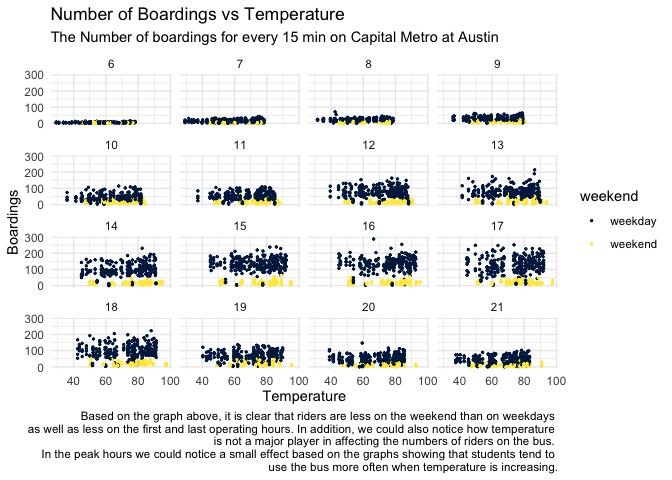
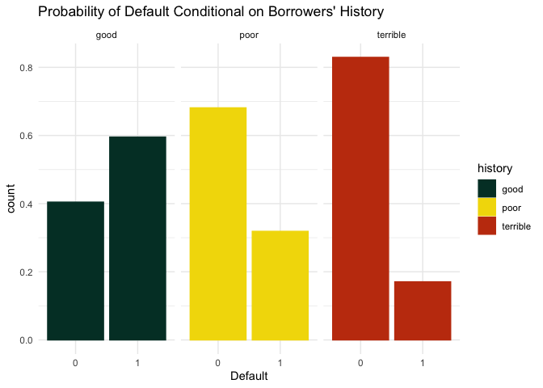
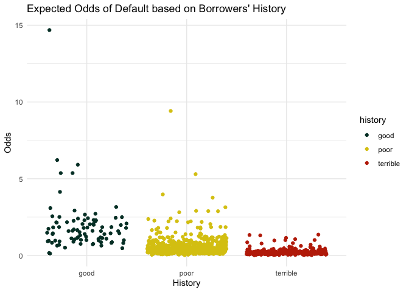
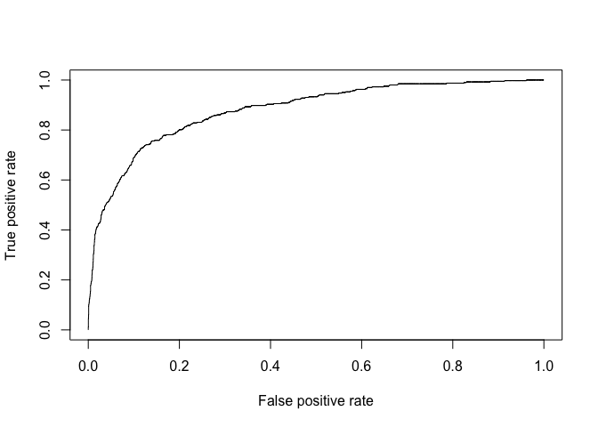

Q1

Q2

    ## Rows: 1,728
    ## Columns: 16
    ## $ price           <int> 132500, 181115, 109000, 155000, 86060, 120000, 153000,…
    ## $ lotSize         <dbl> 0.09, 0.92, 0.19, 0.41, 0.11, 0.68, 0.40, 1.21, 0.83, …
    ## $ age             <int> 42, 0, 133, 13, 0, 31, 33, 23, 36, 4, 123, 1, 13, 153,…
    ## $ landValue       <int> 50000, 22300, 7300, 18700, 15000, 14000, 23300, 14600,…
    ## $ livingArea      <int> 906, 1953, 1944, 1944, 840, 1152, 2752, 1662, 1632, 14…
    ## $ pctCollege      <int> 35, 51, 51, 51, 51, 22, 51, 35, 51, 44, 51, 51, 41, 57…
    ## $ bedrooms        <int> 2, 3, 4, 3, 2, 4, 4, 4, 3, 3, 7, 3, 2, 3, 3, 3, 3, 4, …
    ## $ fireplaces      <int> 1, 0, 1, 1, 0, 1, 1, 1, 0, 0, 0, 0, 0, 0, 0, 0, 0, 1, …
    ## $ bathrooms       <dbl> 1.0, 2.5, 1.0, 1.5, 1.0, 1.0, 1.5, 1.5, 1.5, 1.5, 1.0,…
    ## $ rooms           <int> 5, 6, 8, 5, 3, 8, 8, 9, 8, 6, 12, 6, 4, 5, 8, 4, 7, 12…
    ## $ heating         <fct> electric, hot water/steam, hot water/steam, hot air, h…
    ## $ fuel            <fct> electric, gas, gas, gas, gas, gas, oil, oil, electric,…
    ## $ sewer           <fct> septic, septic, public/commercial, septic, public/comm…
    ## $ waterfront      <fct> No, No, No, No, No, No, No, No, No, No, No, No, No, No…
    ## $ newConstruction <fct> No, No, No, No, Yes, No, No, No, No, No, No, No, No, N…
    ## $ centralAir      <fct> No, No, No, No, Yes, No, No, No, No, No, No, No, No, N…

    ##            (Intercept)                lotSize                    age 
    ##                  38510                   8714                     77 
    ##             livingArea               bedrooms             fireplaces 
    ##                     91                 -14544                   1634 
    ##              bathrooms                  rooms heatinghot water/steam 
    ##                  21791                   3792                 -10721 
    ##        heatingelectric           fuelelectric                fueloil 
    ##                  -6439                 -11891                  -7210 
    ##           centralAirNo 
    ##                 -16145

    ##                      (Intercept)                          lotSize 
    ##                            14519                            11003 
    ##                              age                       livingArea 
    ##                             -284                               80 
    ##                         bedrooms                        bathrooms 
    ##                             -281                            16913 
    ##           heatinghot water/steam                  heatingelectric 
    ##                            -8321                           -14629 
    ##                        landValue                lotSize:landValue 
    ##                                1                                0 
    ##                    age:landValue             landValue:livingArea 
    ##                                0                                0 
    ##               landValue:bedrooms              landValue:bathrooms 
    ##                                0                                0 
    ## landValue:heatinghot water/steam        landValue:heatingelectric 
    ##                                0                                0

    ## [1] 66755.13

    ## [1] 59984.66

    ## [1] 63368

    ##    price price_predlm_class price_predlm_me price_predKNN
    ## 1 132500           103353.8        144141.6      131405.9
    ## 2 181115           230065.4        228388.4      236243.9
    ## 3 109000           195061.9        149264.6      228382.1
    ## 4 155000           212573.5        210451.3      231981.0
    ## 5  86060           119593.4        113683.8      133852.4
    ## 6 120000           130540.8        130204.7      125514.3

#Tax Report Price Predictions

Based on our analysis, we recommend to use the KNN model predictions
since it has the lowest RMSE. In this model we emphasize on the most
effective factors on property prices. We observe that prices depend more
on these factors:-

1- age of the property 2- living area in square feet 3- number of
bedrooms 4- number of bathrooms

So we can predict the price of a property house if we know only these 4
information. We believe these factors have the most predictive power in
a predictive model. Adding the other factors might affect our accuracy
for the model. However, the model has some noticeable difference with
the market price, which might be unfair to tax property owners based on
it. However, it might give a good indication to the tax authority to
have another pricing index as a benchmark against the market value.

So I also provided you with another predictive model that includes more
factors such as type of heating system, size of lot, and making all the
factors depend on the land value specifically. This way we can emphasize
on the land value which what a tax authority value the most. So we can
predict the pricing based on this 2nd predictive model, but we are in
favor of the one called KNN since it shows lower difference between the
preidcted price and the market value on average.

Q3

    ##        history
    ## Default good poor terrible
    ##       0   36  421      243
    ##       1   53  197       50

    ##         (Intercept)            duration              amount         installment 
    ##               -0.71                0.03                0.00                0.22 
    ##                 age         historypoor     historyterrible          purposeedu 
    ##               -0.02               -1.11               -1.88                0.72 
    ## purposegoods/repair       purposenewcar      purposeusedcar       foreigngerman 
    ##                0.10                0.85               -0.80               -1.26

    ## data frame with 0 columns and 0 rows

The model suggests that clients with good credit history have higher
probability of a loan default than an average client with terrible or
poor credit histories. This predictive model can’t be rely on since it
does not reflect the reality. So we cannot rely on such a model to
predict the default odds of a client based on the history. Also, the
bank should adjust the methodology of the case control design. I will
state below the specific concerns with the model.

Does the bank offer the same probability of lending a loan regardless of
client’s credit history? Because it might be the fact that the bank have
already dodged a dozen of bullets when they rejected loan proposals from
terrible or poor clients. So if this hypothesis is true, we expect to
have more default odds for a client with a good credit history since
they have less due diligence analysis applied on them. In this case,
when we perform the comparison between set of defaulted clients and
not-defaulted ones with the same credit history, that would be biased
analysis. The conclusion that we can take from this logistic model is
that the bank should do more due diligence on clients with good credit
history.

or should they? the data needs more diagnostic…

The sample taken is biased since it is not random. Clustering the data
based on credit history would give us a biased sample that we could not
rely on. When the bank took a random sample of loans and compared that
with the set of close matched loans, that means if you are a client with
a good credit history, and you have defaulted, then you have higher
probability of default if I compare you with clients with the same
history. That’s because on average, most of clients with good score
don’t default, so we should not compare them with the same history
score. So it should be random sample with random clustering in order to
have a reliable data.

In short, just improve the methodology of case design in order to have
unbiased model.

Q3

    ## [1] 3.142367

    ## [1] 0.2379954

    ## [1] 0.2379506

    ## [1] 12

    ## [1] 49

    ## [1] 50

## Model validation Step 1

    ##         pred_children
    ## children    0    1
    ##        0 4524   73
    ##        1  257  145

    ## [1] 0.9339868

## Model validation Step 2

    ##  [1]  -3.6285410   3.5130400  -5.7470510  -9.1776920  -0.6367764 -14.0791800
    ##  [7]   3.8873070   1.0755190   1.3274490   0.2975673  -3.5559630  -1.2214190
    ## [13]   7.4568180   1.3271840   5.0599750   1.9238110   1.1605390   6.6744130
    ## [19]   2.1106260   2.2323720

    ## [1] -1.05e-07

We can notice from the data above that we are very close in predicting
whether a reservation has a child or not based on our 3rd model. Based
on the Cross validation, the worst prediction was less than the true
value by 14 reservations, and the best one matches the true data.
