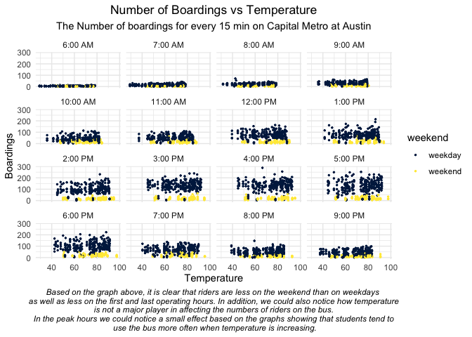
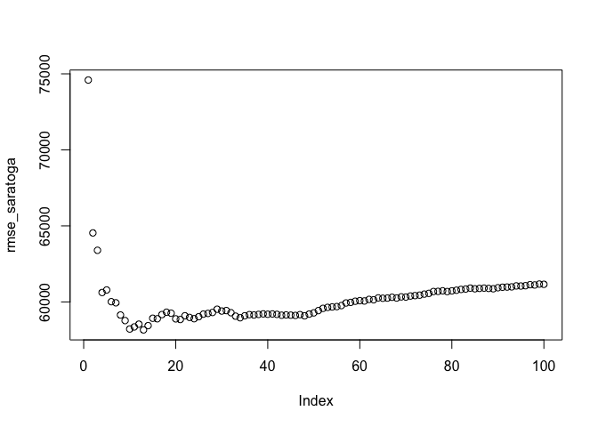

##Problem 1: visualization

##Problem 2: Saratoga house prices

Let’s have a look into the data…

    ## Rows: 1,728
    ## Columns: 16
    ## $ price           <int> 132500, 181115, 109000, 155000, 86060, 120000, 153000,…
    ## $ lotSize         <dbl> 0.09, 0.92, 0.19, 0.41, 0.11, 0.68, 0.40, 1.21, 0.83, …
    ## $ age             <int> 42, 0, 133, 13, 0, 31, 33, 23, 36, 4, 123, 1, 13, 153,…
    ## $ landValue       <int> 50000, 22300, 7300, 18700, 15000, 14000, 23300, 14600,…
    ## $ livingArea      <int> 906, 1953, 1944, 1944, 840, 1152, 2752, 1662, 1632, 14…
    ## $ pctCollege      <int> 35, 51, 51, 51, 51, 22, 51, 35, 51, 44, 51, 51, 41, 57…
    ## $ bedrooms        <int> 2, 3, 4, 3, 2, 4, 4, 4, 3, 3, 7, 3, 2, 3, 3, 3, 3, 4, …
    ## $ fireplaces      <int> 1, 0, 1, 1, 0, 1, 1, 1, 0, 0, 0, 0, 0, 0, 0, 0, 0, 1, …
    ## $ bathrooms       <dbl> 1.0, 2.5, 1.0, 1.5, 1.0, 1.0, 1.5, 1.5, 1.5, 1.5, 1.0,…
    ## $ rooms           <int> 5, 6, 8, 5, 3, 8, 8, 9, 8, 6, 12, 6, 4, 5, 8, 4, 7, 12…
    ## $ heating         <fct> electric, hot water/steam, hot water/steam, hot air, h…
    ## $ fuel            <fct> electric, gas, gas, gas, gas, gas, oil, oil, electric,…
    ## $ sewer           <fct> septic, septic, public/commercial, septic, public/comm…
    ## $ waterfront      <fct> No, No, No, No, No, No, No, No, No, No, No, No, No, No…
    ## $ newConstruction <fct> No, No, No, No, Yes, No, No, No, No, No, No, No, No, N…
    ## $ centralAir      <fct> No, No, No, No, Yes, No, No, No, No, No, No, No, No, N…

###Now we want to build a better model than the one in the class.

    set.seed(430)
    saratoga_split = createDataPartition(SaratogaHouses$price, p = 0.75, list = FALSE)
    saratoga_train = SaratogaHouses[saratoga_split, ]
    saratoga_test = SaratogaHouses[-saratoga_split, ]

    lm_class = train(
      price ~ . - pctCollege - sewer - waterfront - landValue - newConstruction, data=saratoga_train,
      method = "lm", 
      trControl = trainControl(method = "cv", 
                   number = 10, verboseIter = TRUE ))

    ## + Fold01: intercept=TRUE 
    ## - Fold01: intercept=TRUE 
    ## + Fold02: intercept=TRUE 
    ## - Fold02: intercept=TRUE 
    ## + Fold03: intercept=TRUE 
    ## - Fold03: intercept=TRUE 
    ## + Fold04: intercept=TRUE 
    ## - Fold04: intercept=TRUE 
    ## + Fold05: intercept=TRUE 
    ## - Fold05: intercept=TRUE 
    ## + Fold06: intercept=TRUE 
    ## - Fold06: intercept=TRUE 
    ## + Fold07: intercept=TRUE 
    ## - Fold07: intercept=TRUE 
    ## + Fold08: intercept=TRUE 
    ## - Fold08: intercept=TRUE 
    ## + Fold09: intercept=TRUE 
    ## - Fold09: intercept=TRUE 
    ## + Fold10: intercept=TRUE 
    ## - Fold10: intercept=TRUE 
    ## Aggregating results
    ## Fitting final model on full training set

    lm_me = train(
      price ~ . *(landValue) - (rooms -centralAir - fuel - fireplaces- pctCollege - sewer - waterfront - landValue - newConstruction), data=saratoga_train,
      method = "lm", 
      trControl = trainControl(method = "cv", 
                   number = 10, verboseIter = TRUE ))

    ## + Fold01: intercept=TRUE 
    ## - Fold01: intercept=TRUE 
    ## + Fold02: intercept=TRUE 
    ## - Fold02: intercept=TRUE 
    ## + Fold03: intercept=TRUE 
    ## - Fold03: intercept=TRUE 
    ## + Fold04: intercept=TRUE 
    ## - Fold04: intercept=TRUE 
    ## + Fold05: intercept=TRUE 
    ## - Fold05: intercept=TRUE 
    ## + Fold06: intercept=TRUE 
    ## - Fold06: intercept=TRUE 
    ## + Fold07: intercept=TRUE 
    ## - Fold07: intercept=TRUE 
    ## + Fold08: intercept=TRUE 
    ## - Fold08: intercept=TRUE 
    ## + Fold09: intercept=TRUE 
    ## - Fold09: intercept=TRUE 
    ## + Fold10: intercept=TRUE 
    ## - Fold10: intercept=TRUE 
    ## Aggregating results
    ## Fitting final model on full training set

    lm_class$finalModel

    ## 
    ## Call:
    ## lm(formula = .outcome ~ ., data = dat)
    ## 
    ## Coefficients:
    ##              (Intercept)                   lotSize                       age  
    ##                 38619.80                  10012.36                     73.47  
    ##               livingArea                  bedrooms                fireplaces  
    ##                    91.47                 -14956.23                   3667.44  
    ##                bathrooms                     rooms  `heatinghot water/steam`  
    ##                 21648.87                   3506.70                 -14081.86  
    ##          heatingelectric              fuelelectric                   fueloil  
    ##                  9567.43                 -23582.07                 -12556.21  
    ##             centralAirNo  
    ##                -14914.97

    lm_me$finalModel

    ## 
    ## Call:
    ## lm(formula = .outcome ~ ., data = dat)
    ## 
    ## Coefficients:
    ##                        (Intercept)                             lotSize  
    ##                          1.943e+05                           1.822e+04  
    ##                                age                           landValue  
    ##                         -2.859e+02                          -9.997e-01  
    ##                         livingArea                          pctCollege  
    ##                          7.669e+01                          -5.703e+02  
    ##                           bedrooms                          fireplaces  
    ##                          4.064e+01                           1.562e+04  
    ##                          bathrooms            `heatinghot water/steam`  
    ##                          1.201e+04                          -5.667e+03  
    ##                    heatingelectric                        fuelelectric  
    ##                          6.357e+04                          -6.983e+04  
    ##                            fueloil            `sewerpublic/commercial`  
    ##                         -5.212e+03                           5.596e+03  
    ##                          sewernone                        waterfrontNo  
    ##                         -1.495e+04                          -1.431e+05  
    ##                  newConstructionNo                        centralAirNo  
    ##                         -5.917e+03                          -5.803e+03  
    ##                `lotSize:landValue`                     `age:landValue`  
    ##                         -2.557e-01                           5.319e-03  
    ##             `landValue:livingArea`              `landValue:pctCollege`  
    ##                         -3.159e-06                           1.650e-02  
    ##               `landValue:bedrooms`              `landValue:fireplaces`  
    ##                         -1.810e-01                          -3.245e-01  
    ##              `landValue:bathrooms`                   `landValue:rooms`  
    ##                          2.501e-01                           3.967e-02  
    ## `landValue:heatinghot water/steam`         `landValue:heatingelectric`  
    ##                         -3.522e-01                          -1.911e+00  
    ##           `landValue:fuelelectric`                 `landValue:fueloil`  
    ##                          1.901e+00                           1.071e-01  
    ## `landValue:sewerpublic/commercial`               `landValue:sewernone`  
    ##                         -7.019e-02                          -1.455e+00  
    ##           `landValue:waterfrontNo`       `landValue:newConstructionNo`  
    ##                          4.836e-01                           6.220e-01  
    ##           `landValue:centralAirNo`  
    ##                          3.116e-02

    lm_class$results

    ##   intercept     RMSE  Rsquared      MAE   RMSESD RsquaredSD    MAESD
    ## 1      TRUE 67191.63 0.5455177 46591.08 7471.594 0.06269956 3836.455

    lm_me$results

    ##   intercept     RMSE Rsquared      MAE RMSESD RsquaredSD   MAESD
    ## 1      TRUE 65972.78 0.580285 43157.76  14872  0.1186911 4359.14

Based on the RMSE results of the training data, my model outperformed
the one in the class.

###Now lets use KNN model…

    ## numeric(0)

The KNN model with K=27 is the best prediction model among the 3 models
based on the RMSE test.

    ##   Model1_tax_rmse Model2_tax_rmse model3_tax_rmse
    ## 1        64464.31        57763.44        64625.93

Based on the testing data, the KNN model outperformed the other two, but
in terms of training data, the 2nd model has the lowest RMSE.

Now let us put all three predicate models in one table with the true
price.

    ##     price price_predKNN price_predlm_me
    ## 4  155000      226315.4        209022.2
    ## 9   90000      179690.7        176505.9
    ## 12 120000      193064.6        196502.2
    ## 15 127000      178853.6        129030.2
    ## 20  87500      159384.8        133566.9
    ## 22 104900      174268.7        163100.6

###Tax Report Price Predictions

Based on our analysis, we recommend to use the KNN model predictions
since it has the lowest RMSE. In this model we emphasize on the most
effective factors on property prices. We observe that prices depend more
on these factors:-

1- age of the property 2- living area in square feet 3- number of
bedrooms 4- number of bathrooms

So, we can predict the price of a property house if we know only these 4
data. We believe these factors have a good price estimation power.
Adding the other factors might affect our predictive power for the
model.

However, this model have small difference in terms of prediction power
from the best linear model (lm\_me). So, we have included that model as
well in the table to have more than one benchmark to the tax authority
against the real prices.

The price prediction strategy for the 2nd model includes more variable
from the data. So, we used the same variables in the KNN model but
adding lot size and type of heating systems to the model. In addition,
the model considers how all these variables depend on the land value of
the property which would able us to distingiush the land value since it
is an important factor to the authority. In short, we recommend both of
these models to use with a little more favor to the KNN model.

So, your organization could use these data to know whether the market
price is overvalued or undervalued, and use all these information to
create the best pricing estimation for taxing purposes.

##Problem 3: Classification and retrospective sampling

    ##        history
    ## Default good poor terrible
    ##       0   36  421      243
    ##       1   53  197       50

    ##         (Intercept)            duration              amount         installment 
    ##               -0.71                0.03                0.00                0.22 
    ##                 age         historypoor     historyterrible          purposeedu 
    ##               -0.02               -1.11               -1.88                0.72 
    ## purposegoods/repair       purposenewcar      purposeusedcar       foreigngerman 
    ##                0.10                0.85               -0.80               -1.26

    ## data frame with 0 columns and 0 rows

The model suggests that clients with good credit history have higher
probability of a loan default than an average client with terrible or
poor credit histories. This predictive model can’t be rely on since it
does not reflect the reality. So we cannot rely on such a model to
predict the default odds of a client based on the history. Also, the
bank should adjust the methodology of the case control design. I will
state below the specific concerns with the model.

Does the bank offer the same probability of lending a loan regardless of
client’s credit history? Because it might be the fact that the bank have
already dodged a dozen of bullets when they rejected loan proposals from
terrible or poor clients. So if this hypothesis is true, we expect to
have more default odds for a client with a good credit history since
they have less due diligence analysis applied on them. In this case,
when we perform the comparison between set of defaulted clients and
not-defaulted ones with the same credit history, that would be biased
analysis. The conclusion that we can take from this logistic model is
that the bank should do more due diligence on clients with good credit
history.

or should they? the data needs more diagnostic…

The sample taken is biased since it is not random. Clustering the data
based on credit history would give us a biased sample that we could not
rely on. When the bank took a random sample of loans and compared that
with the set of close matched loans, that means if you are a client with
a good credit history, and you have defaulted, then you have higher
probability of default if I compare you with clients with the same
history. That’s because on average, most of clients with good score
don’t default, so we should not compare them with the same history
score. So it should be random sample with random clustering in order to
have a reliable data.

In short, just improve the methodology of case design in order to have
unbiased model.

##Problem 4: Children and hotel reservations

### Model building

    ## 
    ## Call:  NULL
    ## 
    ## Coefficients:
    ##                    (Intercept)          market_segmentAviation  
    ##                        -2.8549                        -12.0104  
    ##    market_segmentComplementary         market_segmentCorporate  
    ##                         0.1514                         -1.8726  
    ##           market_segmentDirect            market_segmentGroups  
    ##                         0.3129                         -2.2868  
    ##  `market_segmentOffline_TA/TO`         market_segmentOnline_TA  
    ##                        -0.9772                              NA  
    ##                         adults              customer_typeGroup  
    ##                         0.2510                         -0.2917  
    ##         customer_typeTransient  `customer_typeTransient-Party`  
    ##                         0.3132                         -0.1626  
    ##              is_repeated_guest  
    ##                        -0.8867  
    ## 
    ## Degrees of Freedom: 33749 Total (i.e. Null);  33738 Residual
    ## Null Deviance:       18980 
    ## Residual Deviance: 17690     AIC: 17720

    ## 
    ## Call:  NULL
    ## 
    ## Coefficients:
    ##                        (Intercept)                     hotelCity_Hotel  
    ##                         -1.713e+01                           7.883e-01  
    ##                  hotelResort_Hotel                           lead_time  
    ##                                 NA                           1.075e-03  
    ##            stays_in_weekend_nights                stays_in_week_nights  
    ##                          5.245e-02                          -5.497e-04  
    ##                             adults                              mealFB  
    ##                         -5.769e-01                           7.047e-01  
    ##                             mealHB                              mealSC  
    ##                          2.824e-02                          -1.270e+00  
    ##                      mealUndefined         market_segmentComplementary  
    ##                          3.506e-01                           1.240e+01  
    ##            market_segmentCorporate                market_segmentDirect  
    ##                          1.132e+01                           1.195e+01  
    ##               market_segmentGroups       `market_segmentOffline_TA/TO`  
    ##                          1.091e+01                           1.237e+01  
    ##            market_segmentOnline_TA          distribution_channelDirect  
    ##                          1.252e+01                           6.870e-01  
    ##            distribution_channelGDS         `distribution_channelTA/TO`  
    ##                         -1.267e+01                           1.169e-01  
    ##                  is_repeated_guest              previous_cancellations  
    ##                         -4.140e-01                          -1.090e-01  
    ##     previous_bookings_not_canceled                 reserved_room_typeB  
    ##                         -4.311e-01                           1.530e+00  
    ##                reserved_room_typeC                 reserved_room_typeD  
    ##                          2.751e+00                          -1.225e+00  
    ##                reserved_room_typeE                 reserved_room_typeF  
    ##                         -5.662e-01                           1.250e+00  
    ##                reserved_room_typeG                 reserved_room_typeH  
    ##                          2.167e+00                           2.723e+00  
    ##                reserved_room_typeL                 assigned_room_typeB  
    ##                         -1.302e+01                           5.351e-01  
    ##                assigned_room_typeC                 assigned_room_typeD  
    ##                          1.693e+00                           1.231e+00  
    ##                assigned_room_typeE                 assigned_room_typeF  
    ##                          1.149e+00                           1.306e+00  
    ##                assigned_room_typeG                 assigned_room_typeH  
    ##                          1.359e+00                           1.887e+00  
    ##                assigned_room_typeI                 assigned_room_typeK  
    ##                          1.777e+00                           7.511e-01  
    ##                    booking_changes              deposit_typeNon_Refund  
    ##                          2.352e-01                           3.906e-01  
    ##             deposit_typeRefundable                days_in_waiting_list  
    ##                          1.369e+00                          -9.082e-03  
    ##                 customer_typeGroup              customer_typeTransient  
    ##                         -3.582e-01                           3.645e-01  
    ##     `customer_typeTransient-Party`                  average_daily_rate  
    ##                         -3.804e-01                           1.045e-02  
    ## required_car_parking_spacesparking           total_of_special_requests  
    ##                          9.432e-02                           4.597e-01  
    ## 
    ## Degrees of Freedom: 33749 Total (i.e. Null);  33701 Residual
    ## Null Deviance:       18980 
    ## Residual Deviance: 12930     AIC: 13030

    ## 
    ## Call:  NULL
    ## 
    ## Coefficients:
    ##                        (Intercept)                     hotelCity_Hotel  
    ##                         -18.713638                            0.788284  
    ##                  hotelResort_Hotel                           lead_time  
    ##                                 NA                            0.001036  
    ##            stays_in_weekend_nights                stays_in_week_nights  
    ##                           0.049472                            0.002197  
    ##                             adults                              mealFB  
    ##                           0.240888                            0.662975  
    ##                             mealHB                              mealSC  
    ##                           0.032776                           -1.266039  
    ##                      mealUndefined         market_segmentComplementary  
    ##                           0.385708                           12.584961  
    ##            market_segmentCorporate                market_segmentDirect  
    ##                          11.431718                           11.970059  
    ##               market_segmentGroups       `market_segmentOffline_TA/TO`  
    ##                          10.933245                           12.405128  
    ##            market_segmentOnline_TA          distribution_channelDirect  
    ##                          12.537591                            0.634144  
    ##            distribution_channelGDS         `distribution_channelTA/TO`  
    ##                         -12.870166                            0.045554  
    ##                  is_repeated_guest              previous_cancellations  
    ##                          -0.347606                           -0.075908  
    ##     previous_bookings_not_canceled                 reserved_room_typeB  
    ##                          -0.435929                            1.624055  
    ##                reserved_room_typeC                 reserved_room_typeD  
    ##                           2.718302                           -1.237414  
    ##                reserved_room_typeE                 reserved_room_typeF  
    ##                          -0.579452                            1.260637  
    ##                reserved_room_typeG                 reserved_room_typeH  
    ##                           2.239478                            2.840828  
    ##                reserved_room_typeL                 assigned_room_typeB  
    ##                         -13.008903                            0.513254  
    ##                assigned_room_typeC                 assigned_room_typeD  
    ##                           1.697935                            1.253190  
    ##                assigned_room_typeE                 assigned_room_typeF  
    ##                           1.155607                            1.292724  
    ##                assigned_room_typeG                 assigned_room_typeH  
    ##                           1.320445                            1.932528  
    ##                assigned_room_typeI                 assigned_room_typeK  
    ##                           1.822782                            1.028671  
    ##                    booking_changes              deposit_typeNon_Refund  
    ##                           0.240853                            0.417874  
    ##             deposit_typeRefundable                days_in_waiting_list  
    ##                           1.377867                           -0.008636  
    ##                 customer_typeGroup              customer_typeTransient  
    ##                          -0.316532                            0.388238  
    ##     `customer_typeTransient-Party`                  average_daily_rate  
    ##                          -0.344669                            0.023718  
    ## required_car_parking_spacesparking           total_of_special_requests  
    ##                           0.084529                            0.454856  
    ##        `adults:average_daily_rate`  
    ##                          -0.006597  
    ## 
    ## Degrees of Freedom: 33749 Total (i.e. Null);  33700 Residual
    ## Null Deviance:       18980 
    ## Residual Deviance: 12860     AIC: 12960

    ##   parameter    RMSE   Rsquared       MAE     RMSESD  RsquaredSD       MAESD
    ## 1      none 0.26845 0.03093589 0.1442358 0.01096227 0.006269159 0.005923727

    ##   parameter      RMSE  Rsquared       MAE      RMSESD RsquaredSD       MAESD
    ## 1      none 0.2292813 0.2946219 0.1045757 0.009461107 0.03248462 0.004819315

    ##   parameter      RMSE  Rsquared       MAE      RMSESD RsquaredSD       MAESD
    ## 1      none 0.2289545 0.2953958 0.1042166 0.008646259 0.04811106 0.004563904

Based on the AIC and the RMSE, the third model is the best fitting model
among all the three.

    ##   Model1_rmse Model2_rmse model3_rmse
    ## 1   0.2671768   0.2260696   0.2254957

Based on the results of the models, the 3rd model outperformed the other
2 other models, and have better rmse than the training data which
implies good fitting and reliable prediction power.

### Model validation Step 1

Based on the ROC curve, the best value would be the furthest value in
the northwest.

### Model validation Step 2

    ##    seq             variable    value children_probability
    ## 1    1 children_predictions 20.26421           0.08105685
    ## 2    2 children_predictions 18.83902           0.07535607
    ## 3    3 children_predictions 22.12987           0.08851949
    ## 4    4 children_predictions 22.93986           0.09175942
    ## 5    5 children_predictions 19.29194           0.07716777
    ## 6    6 children_predictions 24.06665           0.09626660
    ## 7    7 children_predictions 20.70380           0.08281521
    ## 8    8 children_predictions 17.18198           0.06872793
    ## 9    9 children_predictions 19.20678           0.07682712
    ## 10  10 children_predictions 20.91205           0.08364821
    ## 11  11 children_predictions 23.34562           0.09338248
    ## 12  12 children_predictions 18.43439           0.07373757
    ## 13  13 children_predictions 21.47506           0.08590025
    ## 14  14 children_predictions 19.18317           0.07673267
    ## 15  15 children_predictions 19.16753           0.07667012
    ## 16  16 children_predictions 20.07274           0.08029098
    ## 17  17 children_predictions 17.55456           0.07021824
    ## 18  18 children_predictions 17.30992           0.06923966
    ## 19  19 children_predictions 20.03047           0.08012188
    ## 20  20 children_predictions 19.89037           0.07956146
    ## 21   1        children_real 23.00000           0.09200000
    ## 22   2        children_real 20.00000           0.08000000
    ## 23   3        children_real 25.00000           0.10000000
    ## 24   4        children_real 25.00000           0.10000000
    ## 25   5        children_real 18.00000           0.07200000
    ## 26   6        children_real 21.00000           0.08400000
    ## 27   7        children_real 21.00000           0.08400000
    ## 28   8        children_real 20.00000           0.08000000
    ## 29   9        children_real 19.00000           0.07600000
    ## 30  10        children_real 20.00000           0.08000000
    ## 31  11        children_real 23.00000           0.09200000
    ## 32  12        children_real 17.00000           0.06800000
    ## 33  13        children_real 22.00000           0.08800000
    ## 34  14        children_real 17.00000           0.06800000
    ## 35  15        children_real 17.00000           0.06800000
    ## 36  16        children_real 22.00000           0.08800000
    ## 37  17        children_real 16.00000           0.06400000
    ## 38  18        children_real 20.00000           0.08000000
    ## 39  19        children_real 19.00000           0.07600000
    ## 40  20        children_real 17.00000           0.06800000

    ##           Pred vs Real Avg Prob
    ## 1 children_predictions   0.0804
    ## 2        children_real   0.0804

    ##   Model1_rmse Model2_rmse model3_rmse model_val_rmse
    ## 1   0.2671768   0.2260696   0.2254957       1.949253

This plot shows the predicted number of children per fold in red, and
the true number of children per fold in blue. We can notice how the
predictions deviates from the true value by an average of 3.4 children
across all the folds. The rmse in the validation model is a bit higher
than in the models built from the original data. It is expected since
the model was not tailored based on the validation data, but it gave us
quite good estimation.

Furthermore, the true and predicted number of children have the same
probability of a booking that have a kid which it is equal to 8%
probability. In conclustion, I believe this model have good predictive
power, and could be relied on to estimate the number of children in a
booking on a single busy weekend.
