# Homework 3

## 1st problem, What causes what?

**1- Why can’t I just get data from a few different cities and run the
regression of “Crime” on “Police” to understand how more cops in the
streets affect crime? (“Crime” refers to some measure of crime rate and
“Police” measures the number of cops in a city.)**

Basically, it is because of endogeneity issue which means the police
variable is correlated with the error term in the regression (Crime on
Police). In other words, when a city already has high crime rates, the
government might be encouraged to hire more police. It is like asking,
which came first, the chicken or the egg? So, by running a regression
with endogeneity issue, we will have biased results which are
unreliable. Solutions to endogeneity vary based on the situation, but
some of them could be:

1- Find and include omitted variables. 2- Find and include a proxy
variable in the model. 3- Use fixed effect estimator with panel data, by
eliminating individual specific effects. 4- Use Instrument Variable (IV)
to replace the endogenous variable with a predicted value that has only
exogenous shocks.

**2- How were the researchers from UPenn able to isolate this effect?
Briefly describe their approach and discuss their result in the “Table
2” below, from the researchers’ paper.**  First, the researchers have used “Terror
Alert” variable to replace the effect of raising the number of cops
since it is an exogenous variable in the crime model which could solve
the endogeneity issue. However, they have also assumed that “Terror
Alert” might not be quite good proxy since the number of tourists might
decrease when there is a high Terror Alert. In order to consider that,
they have isolated the effect of metro ridership by including log(midday
ridership) as a variable in the regression. So, the first column is the
uncontrolled effect which says that, when Terror Alert elevated (cops in
street increases), the number of daily crime rate is expected to
decrease by 7.32. However, when they control for the metro ridership,
they still expect a decline in the number of crimes by 6.1. As a result,
raising the number of cops would decrease the number of crimes in DC.

**3- Why did they have to control for Metro ridership? What was that
trying to capture?**

They assumed that crime might decrease if the number of tourists decline
as well. So, their results might be biased. Their methodology is to use
“Terror Alert” variable as a proxy to “Police” (number of cops in the
street) since they have high correlation. At the same time, they used
Metro ridership as a proxy for tourism in DC. They did that because they
assumed that crimes and tourists have high correlation, and by having
higher terror alerts, number of crimes might decrease because less
tourists would visit DC. So, by adding Metro ridership in the regression
model, they were able to control for the effect of tourism and to have
the isolated effect of Terror Alert which is a proxy of “Police”. In
other words, after controlling for metro ridership, the number of daily
crimes in DC is expected to decrease by 6.1 when the Terror Alert
elevated.

**4- Below I am showing you “Table 4” from the researchers’ paper. Just
focus on the first column of the table. Can you describe the model being
estimated here? What is the conclusion?**

In this table, the researchers included the district fixed effects in
the regression by using District as an interaction variable with “High
Alert” in order to control for the different pattern of crimes between
the districts when “Terror Alert” elevates. They assumed that most of
the cops would be in District 1 since The White House is there. So, when
there is an order to the police to prioritize district 1, that might
have an effect on the other districts. So, they controlled for this
effect by saying, we want to estimate the partial effect of High Alert
depending whether if it is in District 1 or else.

They have founded out, when High Alert elevates, the number of daily
crimes is expected decrease by 2.6 in District 1. It would also expected
to decrease in the other districts by less than 1. They have also
included the log midday ridership to isolate the tourism effect in the
regression. The interpretation of it is that for every 1% increase in
midday ridership, the number of daily crimes is expected to increase by
2.5 showing high correlation between crimes and the proxy of tourism.
So, it makes sense to isolate the tourism effect in the regression
model.

## 2nd problem, Tree modeling: dengue cases

First, we use CART model.

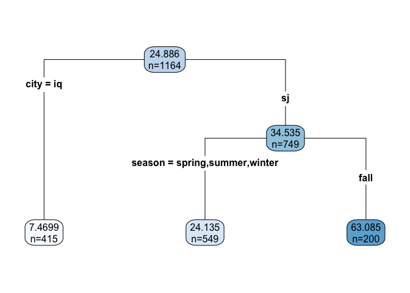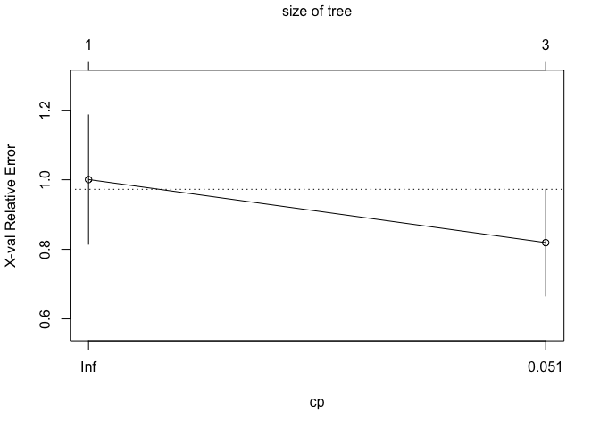

Now we use random forest model.

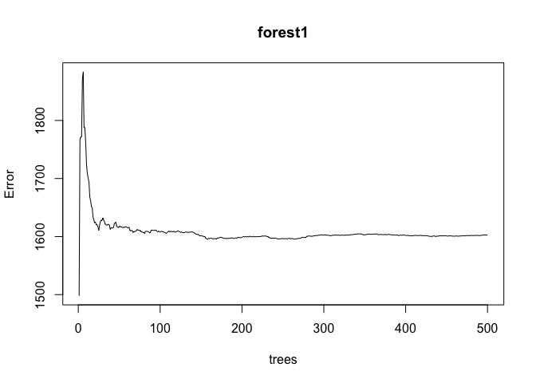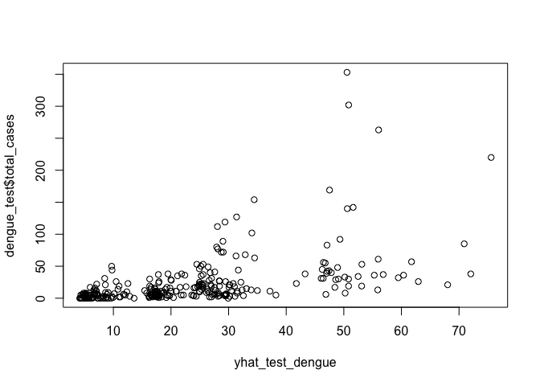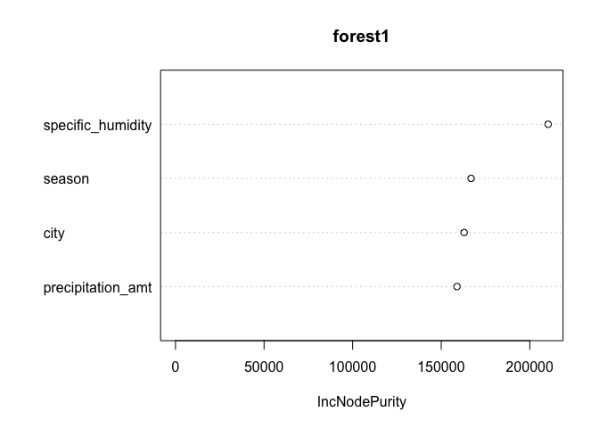

Finally we model by using Boosting alogorthim.

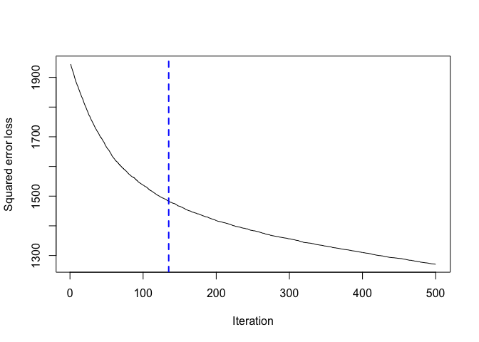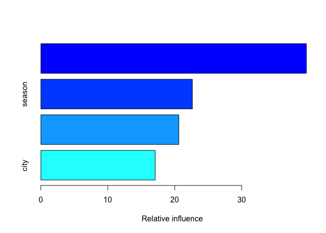

Based on the out of sample RMSE, the Gaussian Booster model seems to
have the best prediction power.

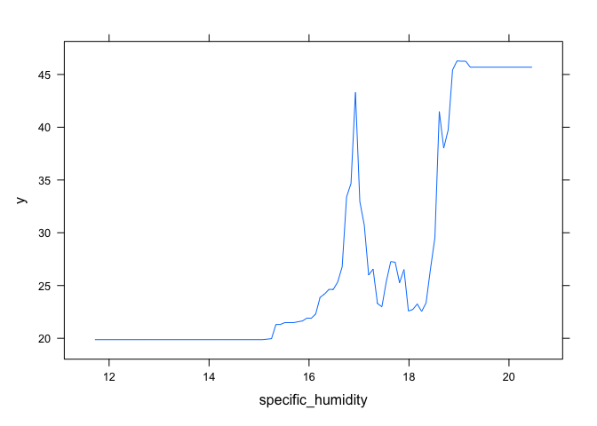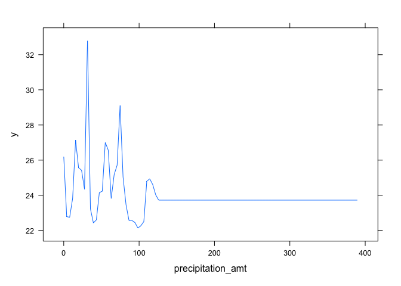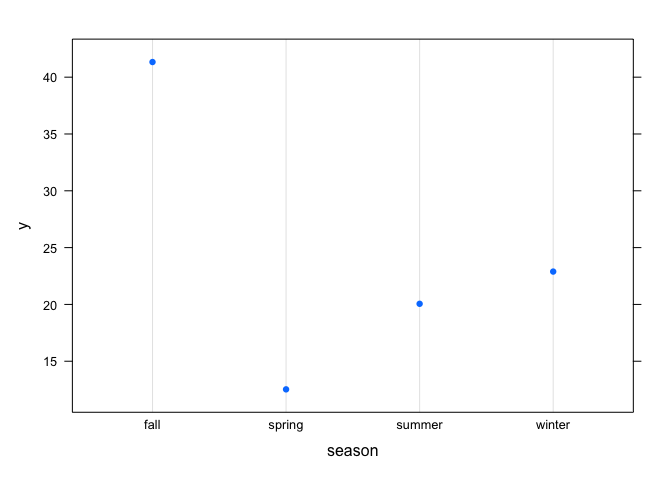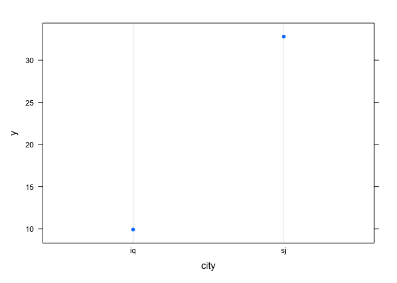

The graphs above show the partial dependence (marginal effects) of the
chosen variables on total cases of dengue based on the Gaussian boosting
model. I have included all 4 variables since all of them seems
interesting, especially with the high difference between the two cities,
and the Fall season with the other seasons.

## 3rd problem, Predictive model building: green certification

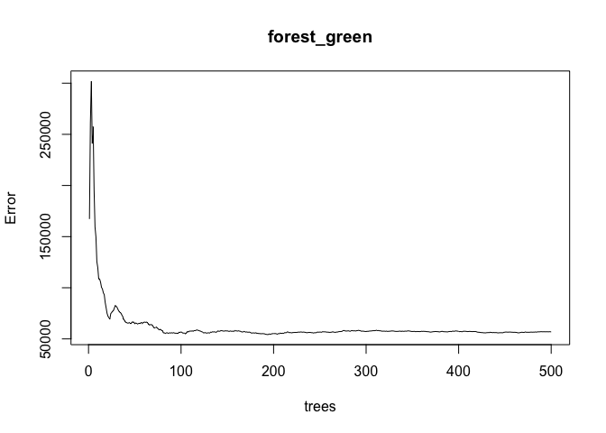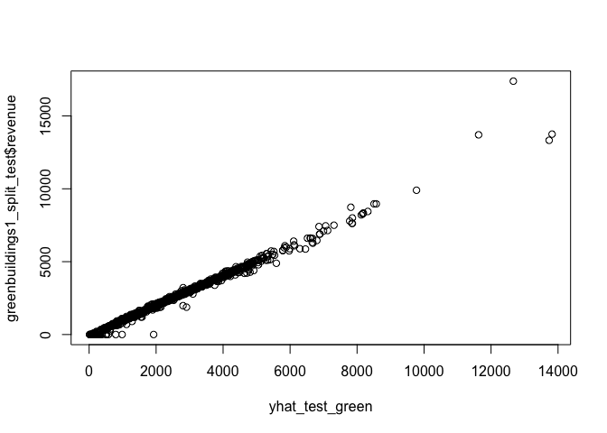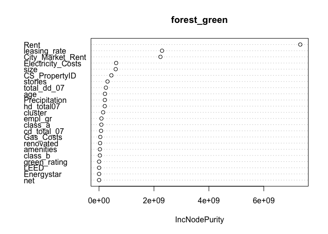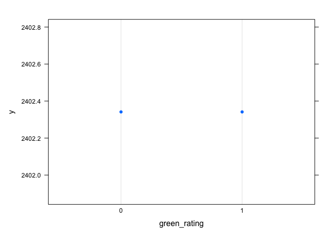

The goal of this excersie is predict the revenue per square foot per
calender year of about 8,000 commercial rental properties across the US.
In addition, some of those properties are green certified which means
they got green certification from either LEED or Energystar. Another
question we want to answer is whether being green certified will raise
your revenue or not. Now let’s move on the methodloly used to predict
the revenue.

First of all, I have mutated a new column to calculate the revenue per
square foot per calender year based on the original data. In order to do
that, I took the product of rent and leasing\_rate. We need to do that
to get unbiased prediction results since the occupancy or the rent\_rate
alone won’t reflect the revenue.

Next, I needed to make sure that some of the variables are dummy
variables, so I used the factor command on the 0/1 variables. Then, I
start working on the model by splitting the data to training set (80%)
and testing set (20%). I trained the data to predict revenue using
random forest model. First model used is the base model, basically by
regressing revenue on all variables, then check for the importance of
each variable in order to try other models and compare them based on the
results of their root mean squared errors.

Now we move to try other possible models based on the results of their
importance. We can notice how green\_rating is not an important variable
in the model which indicates there will not be significant partial
effect of the green certification on the revenue. However, I have to
include it in order to observe the real partial effect using the partial
dependence algorithm.

So, after my base model, the 2nd model included 9 variables with
different importance level for each one of them. The 3rd model had 12
variables with many more less important variables. I worried that it is
going to overfit the model, so now we got to check the rmse for each one
of them and compare it with what we got in the base model. So, the 2nd
model with the 9 variables got slightly lower rmse than the first model
which regressing revenue on all variables. However, should we stop now?
since we are looking for the best predictive model, it is going to be
worth it to try to model using gradient boosting model with the same
variables of the best performing random forest model.

After trying different shrinkage rates, I have succeeded in
over-performing the 2nd model by having rmse = 134 compared to the best
random forest model which was 167. So, I decided to select the boosting
model to answer the question of the how much green certification is
going to affect my revenue assuming all other variables are constant.
So, I predicted the average value for both certified and certified, and
as we can see, it has no partial effect at all. The values basically are
the same and the plot gives us the same answer too.

## 4th problem, Predictive model building: California housing

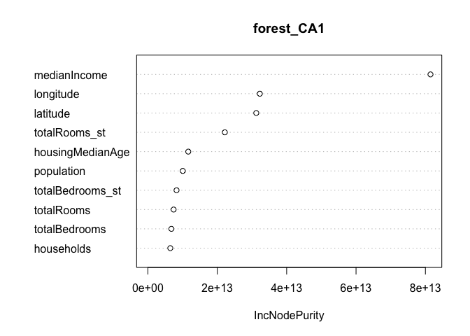

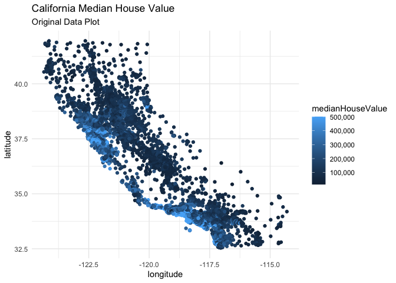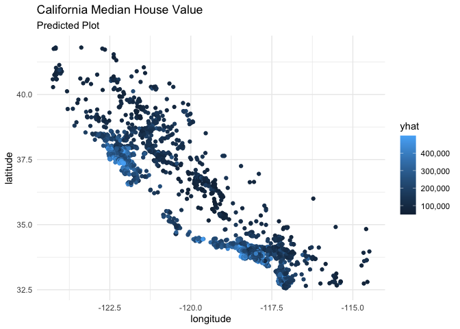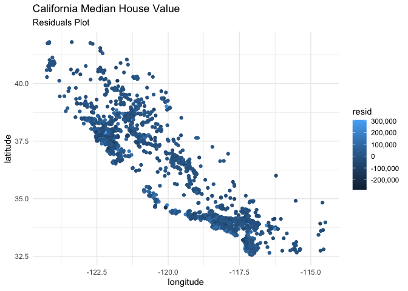

For this model, the aim was to predict the median house value in
California State. In order to do that, I have used machine learning
tools to provide me with reliable predictions. So, I have used the
random forest model which utilize the interaction effects of the
variables. First, I mutated to new columns to standardized the total
rooms and total bedrooms by dividing each variable by households
variable. Then, I split the data into 80% training set and 20% testing
set and regress medianHousevalue on all the variables to test for the
importance of each variables afterward. Next, I did two other
specification models with different variables based on the results of
the variables importance. The third model has the lowest root mean
squared error which equals to 47,989. In order to check for room of
improvements, I run a gradient boosting model with many different
shrinkage rates, but I could not have a lower rmse value than the
selected random forest model.

So, I decided to continue with the results of the optimal random forest
model and predict the median housing values based on the testing set.
Then I plot the original observation which has the shape of California
State, the predicted values based on the testing set, and the estimated
residuals which is the difference between the two.
