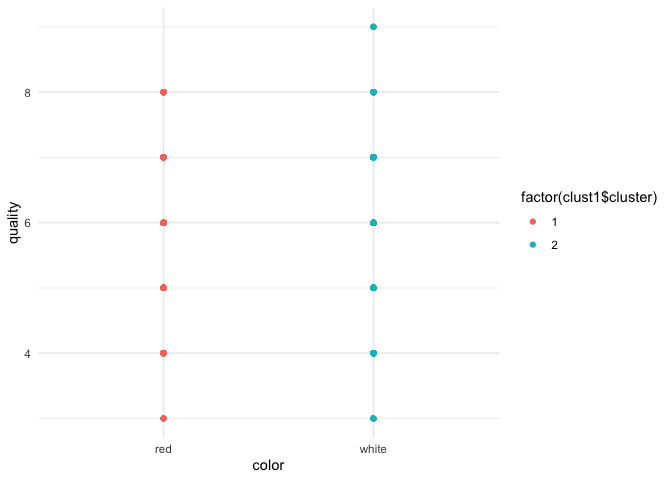
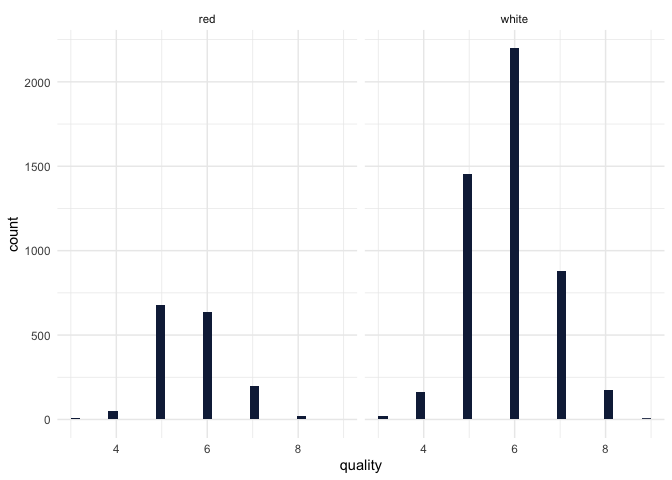
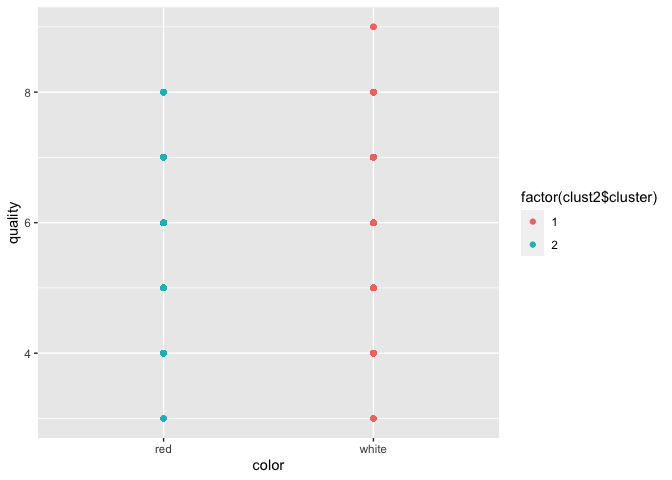
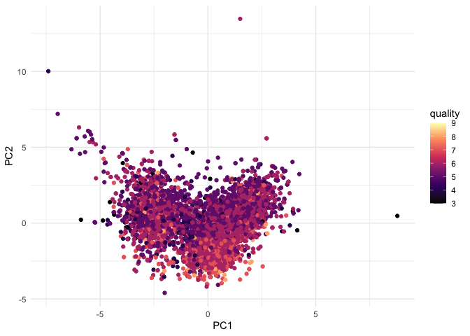
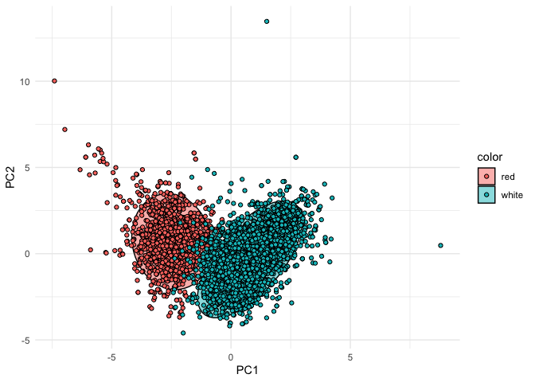
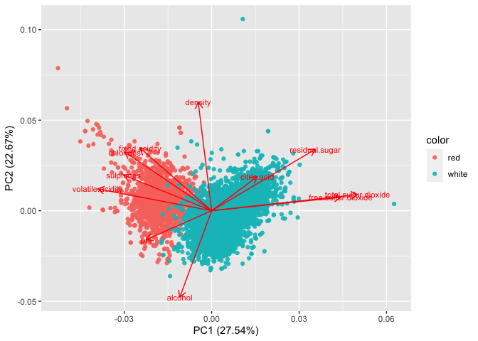
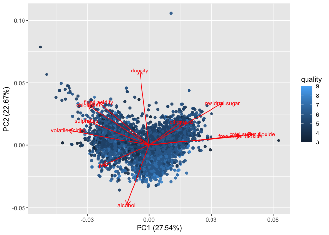

## Problem 1: visualization

First, let’s have a look at the summary of the data.

    ##  fixed.acidity    volatile.acidity  citric.acid     residual.sugar  
    ##  Min.   : 3.800   Min.   :0.0800   Min.   :0.0000   Min.   : 0.600  
    ##  1st Qu.: 6.400   1st Qu.:0.2300   1st Qu.:0.2500   1st Qu.: 1.800  
    ##  Median : 7.000   Median :0.2900   Median :0.3100   Median : 3.000  
    ##  Mean   : 7.215   Mean   :0.3397   Mean   :0.3186   Mean   : 5.443  
    ##  3rd Qu.: 7.700   3rd Qu.:0.4000   3rd Qu.:0.3900   3rd Qu.: 8.100  
    ##  Max.   :15.900   Max.   :1.5800   Max.   :1.6600   Max.   :65.800  
    ##    chlorides       free.sulfur.dioxide total.sulfur.dioxide    density      
    ##  Min.   :0.00900   Min.   :  1.00      Min.   :  6.0        Min.   :0.9871  
    ##  1st Qu.:0.03800   1st Qu.: 17.00      1st Qu.: 77.0        1st Qu.:0.9923  
    ##  Median :0.04700   Median : 29.00      Median :118.0        Median :0.9949  
    ##  Mean   :0.05603   Mean   : 30.53      Mean   :115.7        Mean   :0.9947  
    ##  3rd Qu.:0.06500   3rd Qu.: 41.00      3rd Qu.:156.0        3rd Qu.:0.9970  
    ##  Max.   :0.61100   Max.   :289.00      Max.   :440.0        Max.   :1.0390  
    ##        pH          sulphates         alcohol         quality     
    ##  Min.   :2.720   Min.   :0.2200   Min.   : 8.00   Min.   :3.000  
    ##  1st Qu.:3.110   1st Qu.:0.4300   1st Qu.: 9.50   1st Qu.:5.000  
    ##  Median :3.210   Median :0.5100   Median :10.30   Median :6.000  
    ##  Mean   :3.219   Mean   :0.5313   Mean   :10.49   Mean   :5.818  
    ##  3rd Qu.:3.320   3rd Qu.:0.6000   3rd Qu.:11.30   3rd Qu.:6.000  
    ##  Max.   :4.010   Max.   :2.0000   Max.   :14.90   Max.   :9.000  
    ##     color          
    ##  Length:6497       
    ##  Class :character  
    ##  Mode  :character  
    ##                    
    ##                    
    ## 

Now we create 2 clusters using K-means.

As we can notice, the algorithm succeeded in differentiating between the
wine colors.

Out of curiosity, let’s have a look at the distribution of quality for
each wine color.

White wines have higher frequency in quality that is higher than 7. That
is relatively reflected in the clustered graph by having a point when
quality = 9. However, we don’t see that in the red whine. Also, there
are no points for both wines when quality is lower than 3 which matches
the distribution of the quality variable. So, we can say that the
clustering satisfies the differentiating between red and white wines
including their qualities.

We have tried K = different values, but it failed to answer what is
asked in the question. Therefore, we believe 2 clusters is an option
that satisfies the this part.

However, let’s see if can improve the in-sample fit by doing K-means++.

We got the same graph, but let’s check the cluster sum of errors to
double check.

There was no improvement when we did the K-means++. So the k-means
itself was sufficient.

Now let’s work on PCA…

From the results, we can notice that PC2 explains 50% of the variations,
and PC6 explains 85% as cumulative.

Let’s first work on PCA1 and PCA2.

PCA1 and PCA2 were able to distinguish between red wines and white
wines. There are some blue points lay in the red circle, that’s because
their chemical properties must be very close to each others. However, in
general the algorithm succeed in differentiating the colors. In terms of
quality, it seems the higher quality wines are the points below 0 for
PCA2 and above 0 for PCA1 in general. However, let’s understand how PCA1
and 2 are formed.

Note: We have tried the other PCAs, but it seems like PCA1 and PCA2 is
better at differentiating the colors and quality.

From the graph above we can know that quality is negatively correlated
with density, fixed acidity, chlorides. On the other hand, it is
positively correlated with alcohol.

So we can conclude that the unsupervised algorithm used was relatively
able to distinguish between red and white wines, and between their
qualities. There are margin of errors, but the results still could be
interpreted.
